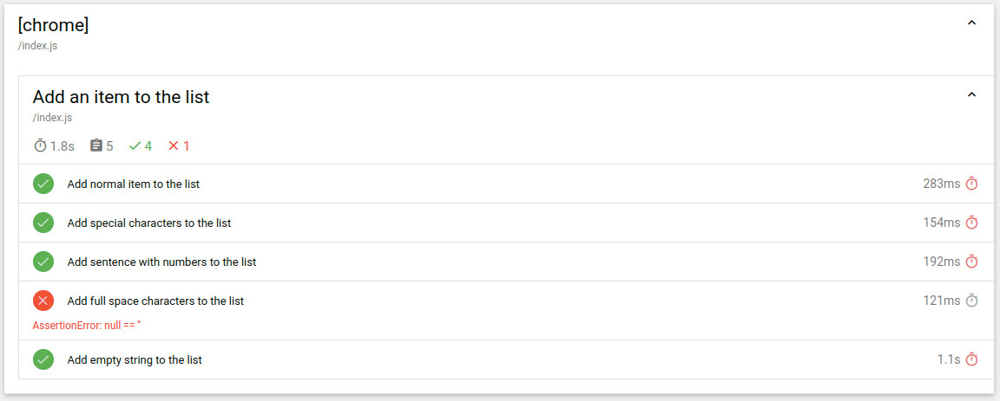
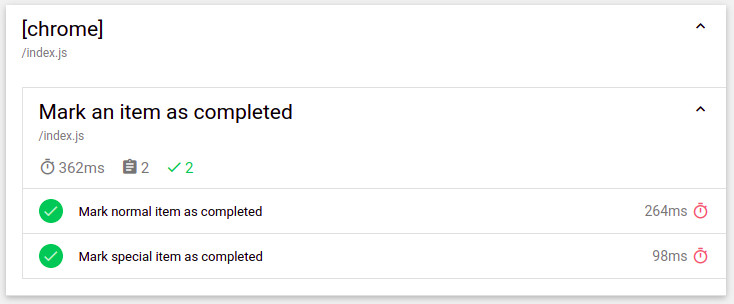
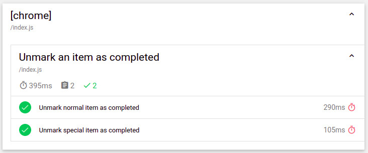
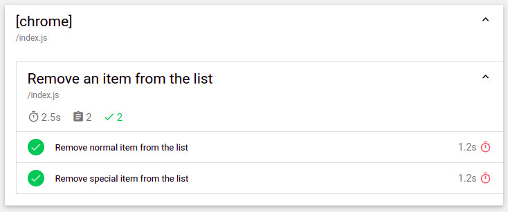

# Selenium

This is sample project test using <a href="https://www.selenium.dev/">Selenium</a> in order to test page <b>TodoList</b> in <a href="https://github.com/docker/getting-started">docker/getting-started</a>

## Installation

```
npm i
```

## Run

```
npm run test:open
```

Or without opening report `npm run test`

## Report

### TodoList
Expand to see more details

<details>
  <summary>Add TodoItem</summary>
  
</details>


<details>
  <summary>Mark TodoItem</summary>
  
</details>


<details>
  <summary>Unmark TodoItem</summary>
  
</details>

<details>
  <summary>Remove TodoItem</summary>
  
</details>
